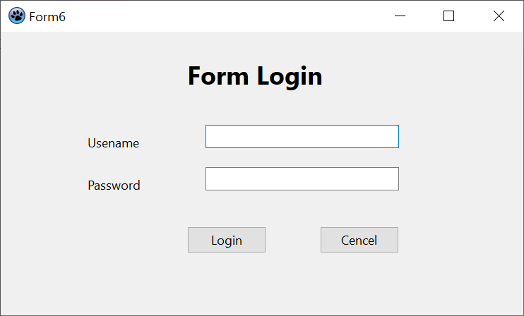
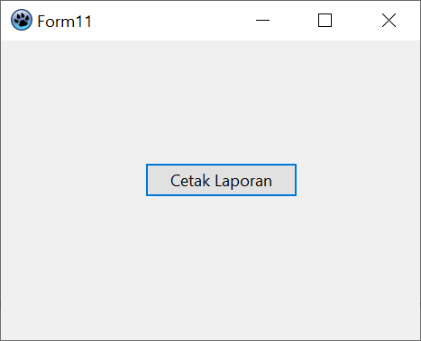

# UAS : PROJECT PEMROGRAMAN VISUAL
| # | Biodata |
| -------- | --- |
| **Nama** | M. Hannata Zahri |
| **NIM** | 312010318 |
| **Kelas** | TI.22.A.4 |
| **Mata Kuliah** | Bahasa Pemrograman |
#

### **Pada dokumen ini, saya akan memberikan beberapa Capture dari hasil project UAS Pemrograman Visual:**

* Halaman Utama

#
* Halaman Login

#
* Halaman Data Barang

#
* Halaman Tambah Data Barang

#
* Halaman Ubah Data Barang

#
* Halaman Detail Barang

#
* Halaman Data Costumer

#
* Halaman Transaksi Penjualan

#
* Halaman Tambah Data Transaksi

#
* Halaman Tambah Detail Data Transaksi

#
* Halaman Cetak Laporan

#
* Contoh Laporan Transaksi

#
* Contoh Laporan Faktur Penjualan

#

* ## Link Video You Tube: <https://www.youtube.com/watch?v=3YYc_58l5zE>

## SEKIAN DAN TERIMA KASIH :smile::smile:
